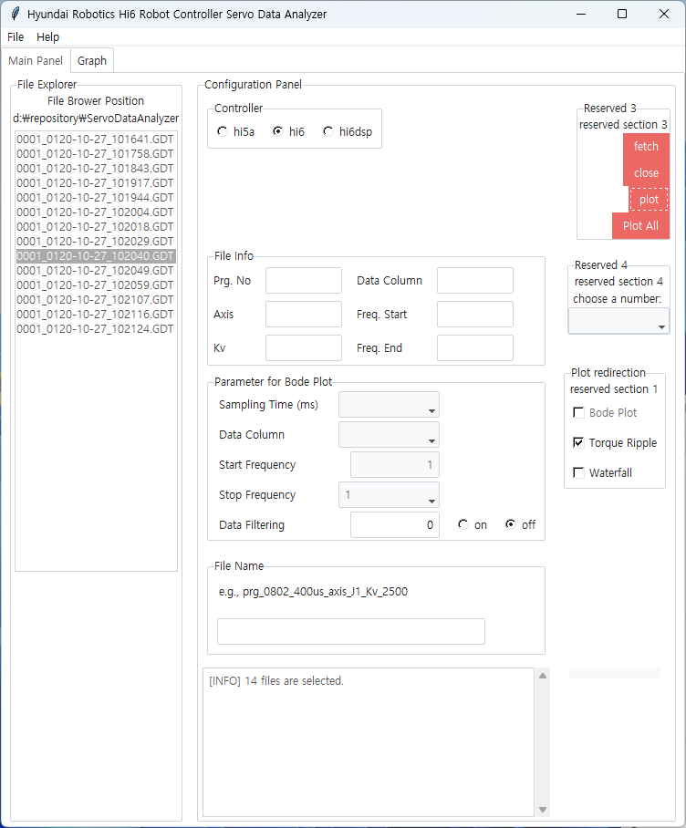
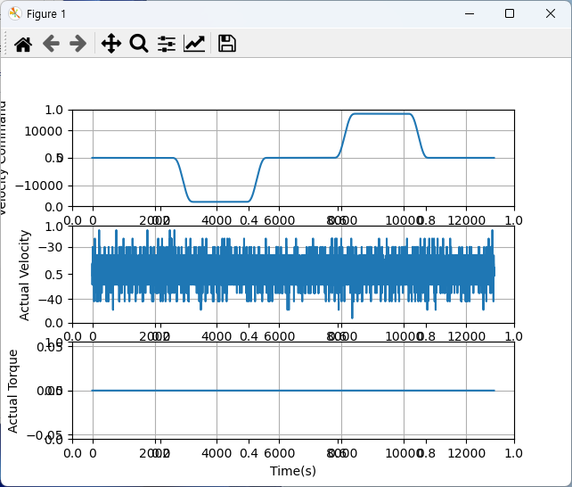
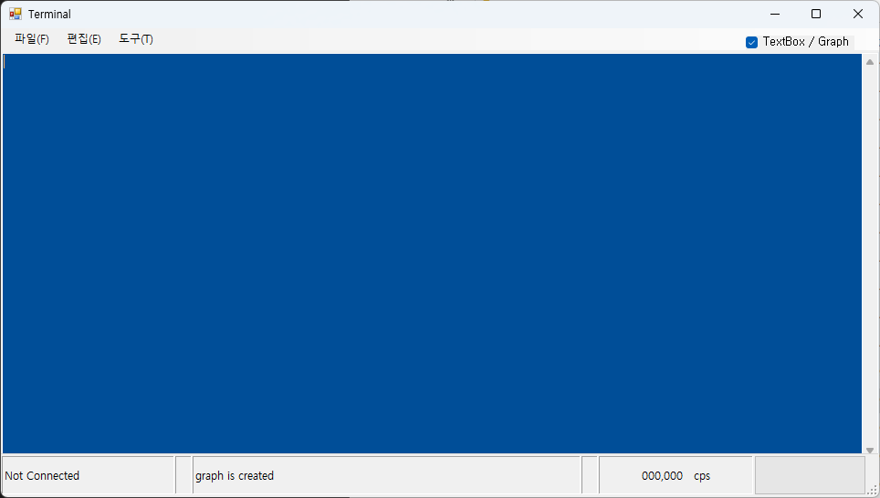
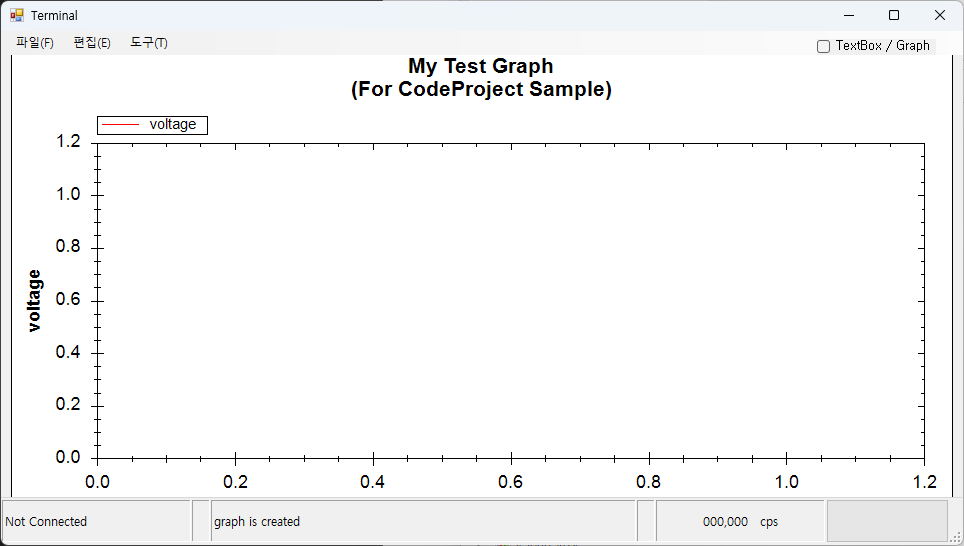
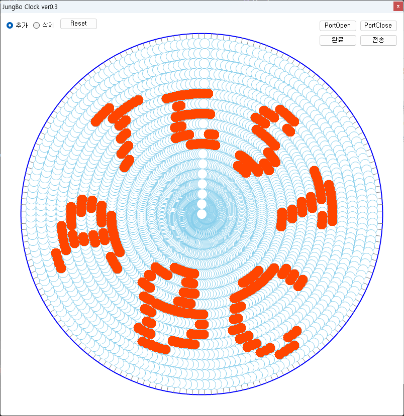
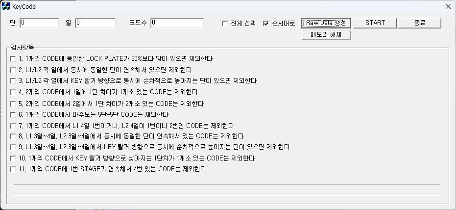
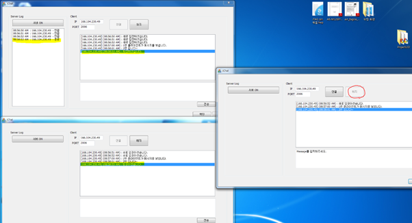
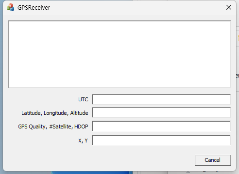

# Skill Set

| LIST  | REMARKS |
|---|---|
| 언어  | C/C++, Python  |   
| GUI | tkinter(python), Windows Forms(C#) | 
| DevOps  | Atlasssian (Jira, Confluence, Bitbucket), Git  | 
| etc  | UML, design pattern   | 

# GUI example
> ## servo analyzer (2021)
- tkinter (python)
<figure>
    
    
</figure>

> ## terminal (2012)
- Windows Forms (C#)
<figure>
    
    
</figure>

> ## SpinLED (2011)
- Windows Forms (C#)
<figure>
    
</figure>

> ## KeyCode (2012)
- MFC, HMC 차량 키 패턴 생성기
<figure>
    
</figure>

> ## Chat (2011)
- MFC, CSocket 클래스
<figure>
    
</figure>

> ## GPS Receiver (2010)
- MFC, NMEA parser
<figure>
    
</figure>